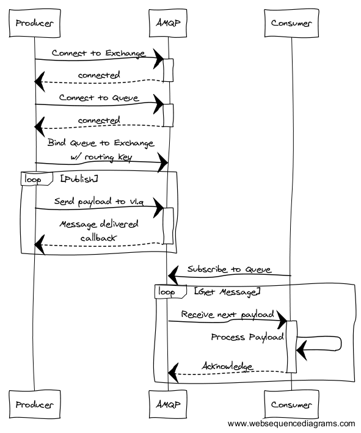
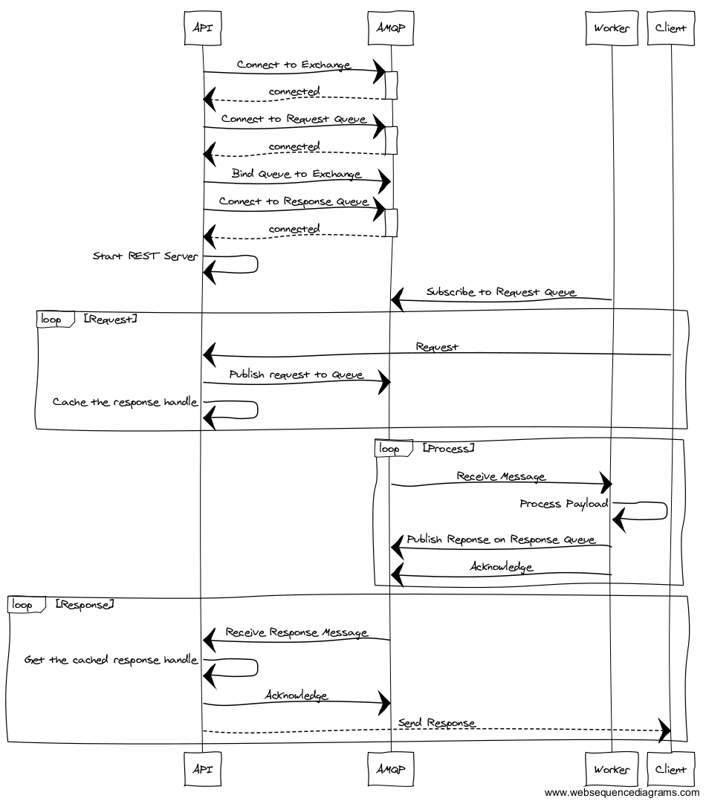
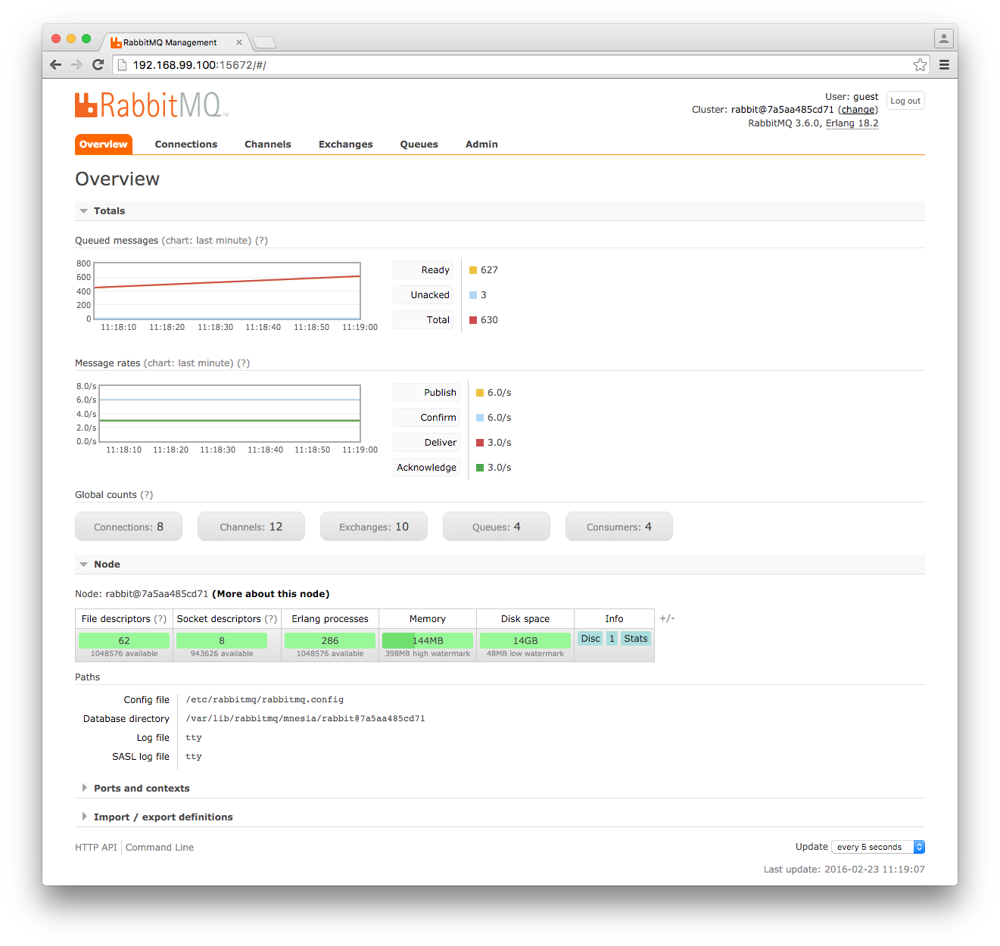

# RabbitMQ example

RabbitMQ provides us with a HA, scalable, fault tolerant message queue that
enables us to easily scale our pipeline horizontally.

To learn more about RabbitMQ checkout their great getting started docs:
https://www.rabbitmq.com/getstarted.html

## Producer / Consumer Workflow

## REST API (RPC) Workflow

Instead of overloading the API heads with computationally intensive work, we can
use a fleet of workers to process requests and send results back to the API.

## Mac Installation

Install homebrew (if necessary):

    /usr/bin/ruby -e "$(curl -fsSL https://raw.githubusercontent.com/Homebrew/install/master/install)"

Install Virtualbox:

    brew tap caskroom/cask
    brew install brew-cask
    brew cask install virtualbox --appdir=/Applications

Install Docker components:

    brew install docker docker-machine docker-compose

## Start up Docker

The Docker daemon only runs on Linux so we need to spin up a Linux virtual
machine to host Docker for us.  Thankfully `docker-machine` makes this process
easy.

Create a Docker machine.  You should only need to do this once:

    docker-machine create --driver virtualbox dev

The step above should also start the Docker machine.  If, for some reason, it
doesn't start, you can do so by:

    docker-machine start dev

You will need to let your shell know where to find docker:

    # bash shell users only
    eval $(docker-machine env dev)

    # fish shell users only
    eval (docker-machine env dev)

## Build and run the Cluster

Build the docker cluster:

    docker-compose build

The producers and consumers reference a container image in the
[docker-compose.yml](docker-compose.yml) rather then point to a Dockerfile.
We'll need to build those containers:

    make

Let's run the cluster now:

    docker-compose up -d

That's it!  Give it a bit of time to spin up the services and you should have a
working cluster.  Check in on what's happening with:

    docker-compose logs

Login to the RabbitMQ admin panel and watch the activity:

    # echo $DOCKER_HOST
    # http://<docker_host_ip>:15672
    # user/pass = guest/guest

This should have created a cluster with the following services:

  - 1 RabbitMQ Server
  - 3 Producers
  - 3 Consumers
  - 1 REST API server
  - 1 API Worker

You can view the full description of the cluster in
[./docker-compose.yml](./docker-compose.yml).

Send a request to the `/echo` route.  Whatever is in the body gets put on the
queue for a worker to process and send back to the API on the reply queue:

    curl -X POST -d '{"hey":"what\'s going on"}' -H 'Content-Type: application/json' <docker_host_ip>:9090/echo

Example:

    $ curl -X POST -d '{"hey":"what\'s going on"}' -H 'Content-Type: application/json' 192.168.99.100:9090/echo
    {"received":{"hey":"what's going on"}}

## Add more containers

    docker-compose scale <container>=<# requested>
    docker-compose scale consumer_v3=3

## List all containers

Note the two new containers we just created by scaling consumer_v3 to 3 instances.

    $ docker-compose ps

                Name                           Command                          State                           Ports
    -----------------------------------------------------------------------------------------------------------------------------
    rmqexample_api-worker_1         /bin/sh -c node_modules/.b      Up
                                    ...
    rmqexample_api_1                /bin/sh -c node_modules/.b      Up                              0.0.0.0:9090->9090/tcp
                                    ...
    rmqexample_consumer_v1_1        /bin/sh -c node_modules/.b      Up
                                    ...
    rmqexample_consumer_v2_1        /bin/sh -c node_modules/.b      Up
                                    ...
    rmqexample_consumer_v3_1        /bin/sh -c node_modules/.b      Up
                                    ...
    rmqexample_consumer_v3_2        /bin/sh -c node_modules/.b      Up
                                    ...
    rmqexample_consumer_v3_3        /bin/sh -c node_modules/.b      Up
                                    ...
    rmqexample_producer_v1_1        /bin/sh -c node_modules/.b      Up
                                    ...
    rmqexample_producer_v2_1        /bin/sh -c node_modules/.b      Up
                                    ...
    rmqexample_producer_v3_1        /bin/sh -c node_modules/.b      Up
                                    ...
    rmqexample_rabbitmq_1           /docker-entrypoint.sh rabb      Up                              15671/tcp,
                                    ...                                                             0.0.0.0:15672->15672/tcp,
                                                                                                    25672/tcp, 4369/tcp,
                                                                                                    5671/tcp,
                                                                                                    0.0.0.0:5672->5672/tcp

## Stop the cluster

    docker-compose stop

    docker-compose stop <container>

## Stop the docker machine

It is not necessary, to stop the docker machine, however, you may want to
release the VM's resources.

    docker-machine stop dev

To start the docker machine up again:

    docker-machine start dev
    docker-machine env dev

To completely remove the VM:

    docker-machine rm dev

# Annotated Docs

RPC Workflow ([Rabbit Example](https://www.rabbitmq.com/tutorials/tutorial-six-python.html)):

 - [API](https://trizic.github.io/rmq-example/api.html)
 - [API Worker](https://trizic.github.io/rmq-example/api-worker.html)

Topic Exchange ([Rabbit Example](https://www.rabbitmq.com/tutorials/tutorial-five-python.html)):
  - [Consumer](https://trizic.github.io/rmq-example/consumer.html)
  - [Producer](https://trizic.github.io/rmq-example/producer.html)
